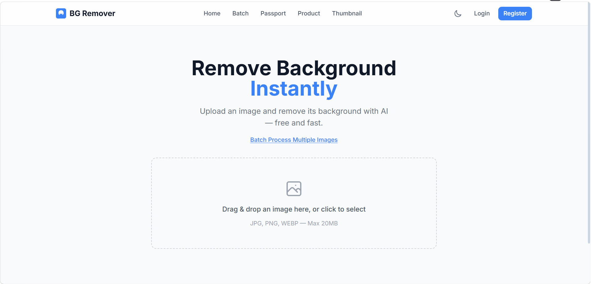

# Background Remover

An AI-powered background remover web application built with React, Express, and Sharp. Uses remove.bg and Clipdrop APIs for background removal with automatic fallback.

## Screenshots

> *Add screenshots here. Recommended screenshots:*
>
> 1. **Home page** — Drag-and-drop upload interface
> 2. **Editor** — Before/after slider showing removed background
> 3. **Background Picker** — Color, gradient, and image replacement options
> 4. **Image Editor** — Crop, resize, rotate, and adjust controls
> 5. **Batch Processing** — Upload up to 20 images for bulk processing
> 6. **Dashboard** — Usage statistics and history
> 7. **Admin Panel** — User management and analytics charts
>
> 
> 
> 

## Features

- **Background Removal** — Remove backgrounds using remove.bg API with automatic Clipdrop fallback
- **Background Replacement** — Replace with solid colors, gradients, or custom images
- **Image Editor** — Crop, resize, rotate, brightness/contrast adjustments
- **Before/After Slider** — Compare original and processed images
- **Batch Processing** — Process up to 20 images at once with ZIP download
- **Download Options** — PNG/JPEG/WebP formats with adjustable quality
- **User Authentication** — Register, login, Google OAuth (requires MongoDB)
- **Dashboard & History** — Track usage and manage past edits (requires MongoDB)
- **Admin Panel** — User management, usage analytics with charts (requires MongoDB)
- **Advanced Tools** — Passport photo generator, product photo creator, thumbnail maker
- **Dark Mode** — Full dark theme support
- **Responsive Design** — Works on desktop and mobile

## Quick Start

### Prerequisites

- Node.js 18+
- npm
- (Optional) MongoDB for auth/history features

### Installation

```bash
# Clone the repository
git clone https://github.com/nrkavya5-lab/Background-Remover.git
cd Background-Remover

# Install dependencies
cd server && npm install
cd ../client && npm install
cd ..

# Set up environment variables
cp .env.example server/.env
```

### Configuration

Edit `server/.env` and add your API keys:

```env
# Get a free API key from https://clipdrop.co/apis
CLIPDROP_API_KEY=your_clipdrop_api_key_here

# (Optional) Get a key from https://www.remove.bg/api
REMOVE_BG_API_KEY=your_remove_bg_api_key_here

# (Optional) Required only for auth/history/admin features
MONGODB_URI=your_mongodb_connection_string_here

# (Optional) Change this for production
JWT_SECRET=your_jwt_secret_here_change_in_production
```

### Run

```bash
npm run dev
```

This starts both the Vite frontend (port 5173) and Express backend (port 5000). Open http://localhost:5173.

## Project Structure

```
Background-Remover/
├── client/                  # React frontend (Vite + Tailwind)
│   ├── src/
│   │   ├── components/      # Reusable UI components
│   │   ├── pages/           # Page components
│   │   ├── hooks/           # Custom React hooks
│   │   ├── context/         # React context providers
│   │   ├── services/        # API client
│   │   └── __tests__/       # Frontend tests
│   └── ...
├── server/                  # Express backend
│   ├── routes/              # API route handlers
│   ├── services/            # Business logic (remove.bg, Clipdrop)
│   ├── middleware/          # Auth and admin middleware
│   ├── models/              # Mongoose models
│   ├── config/              # Database configuration
│   ├── __tests__/           # Backend tests
│   └── uploads/             # Uploaded images
├── .env.example             # Environment variable template
├── package.json             # Root scripts (dev, build, test)
├── vercel.json              # Vercel deployment config
└── Dockerfile               # Docker deployment
```

## Tech Stack

| Layer     | Technology                          |
|-----------|-------------------------------------|
| Frontend  | React, Vite, Tailwind CSS, Recharts |
| Backend   | Express.js, Node.js                 |
| Image     | Sharp, remove.bg API, Clipdrop API  |
| Auth      | JWT, bcryptjs, Google OAuth         |
| Database  | MongoDB, Mongoose (optional)        |
| Deploy    | Vercel (frontend), Render (backend) |

## License

MIT
